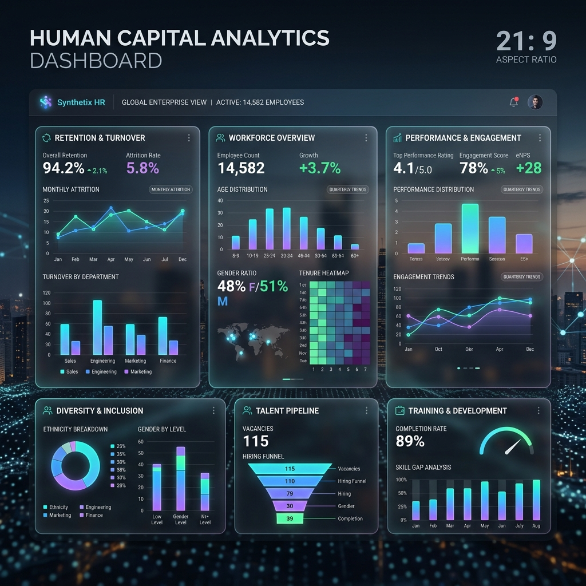

  
  
   
  
  
  
  

## 🎤 Presentation & Deep Dive Materials

We have constructed a comprehensive suite of presentation-ready documents designed to explain exactly how this system works, from high-level business value to deep architectural decisions. If you are presenting this project, read through the `docs/` folder in this exact order:

1. **[Executive Summary / Pitch Script](docs/SUMMARY.md)**: Start here. The "Why" and the "What." Designed to be read aloud as an executive pitch outlining ROI and core business logic.
2. **[Live Demo Guide](docs/HOW_TO_RUN.md)**: A step-by-step instructional script on how to flawlessly execute the application during a live presentation.
3. **[FAQ & Q/A Bank](docs/FAQ_AND_QA_BANK.md)**: Keep this open during your presentation. It contains detailed answers to anticipated audience questions regarding bias, security, and next steps.
4. **[Architecture & Technology Manifesto](docs/ARCHITECTURE_AND_TECH.md)**: The deep-dive into the "How." Explains exactly why tools like Flask, SQLite, and Scikit-Learn were chosen over alternatives.
5. **[File Descriptions & Logic Flow](docs/FILE_DESCRIPTIONS.md)**: Explains the internal circuitry of the codebase.
6. **[Project Directory Tree](docs/PROJECT_TREE.md)**: A visual representation of folder structures.
7. **[Development Steps & History](docs/DEVELOPMENT_STEPS.md)**: A chronological log of how the system was built.

---

## 🌐 Live Application
The fully functional production application is currently live on Render:
👉 **[Access Apex Analytics Here](https://ai-employee-retention.onrender.com/)**

*(For security and system health, the app requires authentication. If deployed locally, you can initialize the DB using `python app/init_db.py` to generate the default `admin`/`password` account.)*

---

## 🚀 Key Features

*   **Dual Machine Learning Architecture**: 
    *   **Baseline API Model:** 88% accurate Logistic Regression model allowing fast, linear, highly explainable real-time inferences.
    *   **Advanced Analytical Model:** Deep Random Forest algorithm analyzing nonlinear patterns to map exactly which corporate systemic issues are causing attrition.
*   **Executive Dashboard**: A premium, visually stunning web UI featuring Glassmorphism design aesthetics, allowing non-technical HR leaders to consume AI metrics instantly.
*   **Batch Roster Processing**: Instead of single entries, executives can drag-and-drop massive `.csv` files into the portal to generate an instant triage list ranking hundreds of employees by flight risk.
*   **Bank-Grade Security**: Fully guarded via `Flask-Login` session management, utilizing `werkzeug pbkdf2:sha256` password hashing to protect sensitive HR data.
*   **Persistent Historical Auditing**: Seamless `Flask-SQLAlchemy` (SQLite) integration ensures every single interaction and risk profile is permanently logged for HR auditing.

---

## 🛠️ Technology Stack

| Domain | Tools Used |
| :--- | :--- |
| **Machine Learning** | `scikit-learn`, `numpy`, `pandas`, `joblib` |
| **Web Framework** | `Flask`, `Flask-Login`, `Flask-SQLAlchemy` |
| **Frontend/UI** | `HTML5`, Vanilla CSS, `Chart.js` |
| **Production/DevOps** | `Gunicorn`, `Docker`, `Pytest`, `GitHub Actions (CI/CD)` |