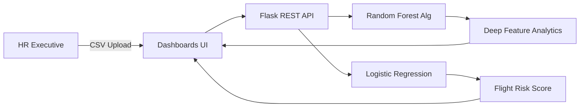

  
# 🧠 Apex Analytics: HR Attrition Engine

**A Production-Ready AI Suite for Proactive HR Decision Making.**

---

## 🏗️ Architecture Flow

## 🌐 Live Application
👉 **[Access Apex Analytics Here](https://ai-employee-retention.onrender.com/)**
